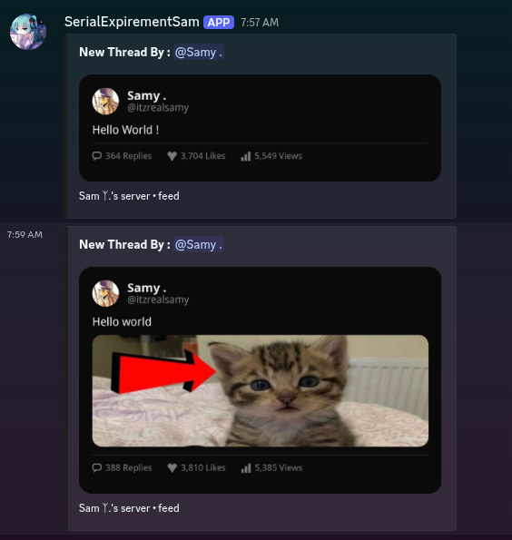

# ThreadIt

A small Discord bot I made to turn Discord messages into clean, social-media-style thread cards.

I wanted something that could take a normal Discord message and make it look more like a proper post/feed card, while keeping things simple and customizable. It grabs the message content, avatar, attachments, and server icon, then generates the card as an image.

## Preview

  

d something broken, have an idea, or just want to improve it, feel free to open an issue or contribute. ❤️

## Built With

* Python
* Discord.py
* Pillow
* aiohttp

